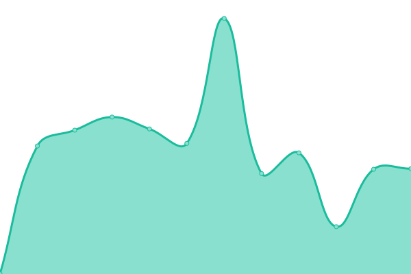

# [📈 Live Status](https://gnfi.github.io/uptime): <!--live status--> **🟩 All systems operational**

This repository contains the open-source uptime monitor and status page for [Good News From Indonesia](https://www.goodnewsfromindonesia.id), powered by [Upptime](https://github.com/upptime/upptime).

With [Upptime](https://upptime.js.org), you can get your own unlimited and free uptime monitor and status page, powered entirely by a GitHub repository. We use [Issues](https://github.com/gnfi/uptime/issues) as incident reports, [Actions](https://github.com/gnfi/uptime/actions) as uptime monitors, and [Pages](https://gnfi.github.io/uptime) for the status page.

<!--start: status pages-->
<!-- This summary is generated by Upptime (https://github.com/upptime/upptime) -->
<!-- Do not edit this manually, your changes will be overwritten -->
<!-- prettier-ignore -->
| URL | Status | History | Response Time | Uptime |
| --- | ------ | ------- | ------------- | ------ |
|  [Good News From Indonesia](https://www.goodnewsfromindonesia.id) | 🟩 Up | [good-news-from-indonesia.yml](https://github.com/gnfi/status/commits/HEAD/history/good-news-from-indonesia.yml) | 

 808ms
     
 | 

<a href="https://status.goodnews.id/history/good-news-from-indonesia">100.00%</a>
    

|  [Seasia](https://seasia.co) | 🟩 Up | [seasia.yml](https://github.com/gnfi/status/commits/HEAD/history/seasia.yml) | 

 1710ms
     
 | 

<a href="https://status.goodnews.id/history/seasia">95.23%</a>
    

|  [Rekam Indonesia](https://www.rekamindonesia.id) | 🟩 Up | [rekam-indonesia.yml](https://github.com/gnfi/status/commits/HEAD/history/rekam-indonesia.yml) | 

 3643ms
     
 | 

<a href="https://status.goodnews.id/history/rekam-indonesia">100.00%</a>
    

|  [GoodSide](https://goodside.id) | 🟩 Up | [good-side.yml](https://github.com/gnfi/status/commits/HEAD/history/good-side.yml) | 

 1810ms
     
 | 

<a href="https://status.goodnews.id/history/good-side">100.00%</a>
    

|  [GoodStats](https://goodstats.id) | 🟩 Up | [good-stats.yml](https://github.com/gnfi/status/commits/HEAD/history/good-stats.yml) | 

 1725ms
     
 | 

<a href="https://status.goodnews.id/history/good-stats">100.00%</a>
    

|  [Karier](https://karier.goodnews.id/) | 🟩 Up | [karier.yml](https://github.com/gnfi/status/commits/HEAD/history/karier.yml) | 

 454ms
     
 | 

<a href="https://status.goodnews.id/history/karier">100.00%</a>
    

|  [Media Partner](https://partner.goodnews.id/media) | 🟩 Up | [media-partner.yml](https://github.com/gnfi/status/commits/HEAD/history/media-partner.yml) | 

 482ms
     
 | 

<a href="https://status.goodnews.id/history/media-partner">100.00%</a>
    

|  [Sertifikat Download](https://sertifikat.download) | 🟩 Up | [sertifikat-download.yml](https://github.com/gnfi/status/commits/HEAD/history/sertifikat-download.yml) | 

 1213ms
     
 | 

<a href="https://status.goodnews.id/history/sertifikat-download">100.00%</a>
    

<!--end: status pages-->

[**Visit our status website →**](https://gnfi.github.io/uptime)

## 📄 License

- Powered by: [Upptime](https://github.com/upptime/upptime)
- Code: [MIT](./LICENSE) © [Good News From Indonesia](https://www.goodnewsfromindonesia.id)
- Data in the `./history` directory: [Open Database License](https://opendatacommons.org/licenses/odbl/1-0/)
